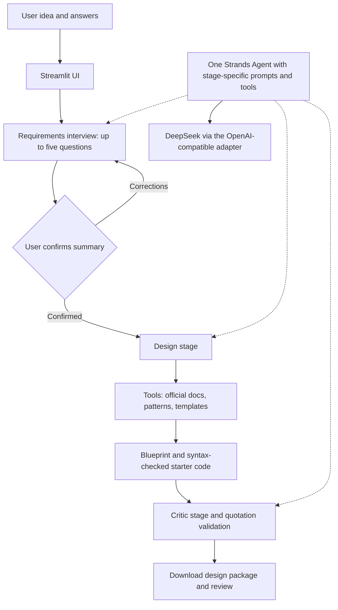

# Agent Architect

Turn an idea into confirmed requirements, an architecture blueprint, Python starter code, and a critique. Built for first-time agent developers with **Strands Agents**, **DeepSeek**, and **Streamlit**.

## Features

- Requirements interview with a code-enforced maximum of five questions.
- Mandatory user confirmation; changes require reconfirmation.
- Three real tools: official Strands documentation retrieval, architecture pattern lookup, and code template retrieval.
- Downloadable requirements, blueprint, starter code, and review reports.
- Critic feedback with quotations checked against the source material. The judgments still require human review.

## Architecture



The application controls the stages and confirmation gates. One session-owned Strands Agent is reused with different prompts and tools; this is not a multi-agent system. The model selects clarification categories and design options. Interview question wording uses fixed templates. Documentation retrieval reads selected official pages, not vector RAG or general web search.

## Installation: Windows / PowerShell

Prerequisites: **Python 3.10+**, internet access, and your own authorized DeepSeek API key with available quota. API calls may incur charges. Windows is the locally tested platform; the UI is primarily Chinese.

Download or clone this repository, open PowerShell in its directory, then run:

```powershell
python -m venv .venv
.\.venv\Scripts\python.exe -m pip install -r requirements.txt
Copy-Item .env.example .env
```

Edit `.env` and set `DEEPSEEK_API_KEY`. Never publish this file. Choose a model available to your account. Existing environment variables take precedence over `.env`. Connection settings can also be entered in the application sidebar.

```powershell
.\.venv\Scripts\python.exe -m streamlit run app.py --server.address 127.0.0.1 --server.port 8501
```

Open http://127.0.0.1:8501 and keep the server running.

1. Enter your agent idea and answer the clarification questions.
2. Review and confirm the requirement summary.
3. Generate and inspect the blueprint, starter code, and tool records.
4. Run the Critic and download the results.

Example idea: "I want an agent that helps students plan assignments and revision. Students enter tasks and deadlines themselves. It should suggest a plan, never change a calendar, and leave final decisions to the student."

## Verification

Offline tests (no API key or model charges):

```powershell
.\.venv\Scripts\python.exe -m unittest -v test_discovery test_blueprint test_critic
```

Optional real-model checks (consume your API quota):

```powershell
.\.venv\Scripts\python.exe smoke_test.py
.\.venv\Scripts\python.exe verify_flow_live.py
```

26 offline tests passed on September 14, 2026. Three consecutive live flows for one study-assistant scenario passed on September 11, 2026. These checks do not guarantee reliability across scenarios or providers. External user testing is pending.

## Limitations and security

- This is an initial design assistant, not a one-click application builder or deployment service.
- Business integrations in generated code may be `NotImplementedError` placeholders. Generated code receives syntax checks and is not executed by this application.
- The starter CLI is single-turn. Blueprint capabilities such as multi-turn interaction need further implementation.
- Critic feedback is not automatically applied and can be mistaken or repeat known limitations.
- An intermittent generation failure remains unroot-caused. Manual retry is available; other model providers have not been fully verified.
- Session data is temporary and may be lost on refresh or disconnection.
- There is no authentication. Do not publicly expose a server using a funded API key without appropriate access controls.
- Downloaded starter code reads `MODEL_API_KEY`, `MODEL_BASE_URL`, and `MODEL_ID` from environment variables; it does not include your key.

## Implementation and attribution

`discovery.py` handles requirements and confirmation state, `architecture_tools.py` implements the tools, `blueprint.py` validates designs and renders templates, `critic.py` validates review evidence, and `app.py` provides the interface. `model_config.py` creates the model connection. Runtime templates and patterns are included in this repository.

Development used **Codex as an AI coding assistant**. Third-party dependencies include Strands Agents, Streamlit, python-dotenv, Pydantic, and the OpenAI SDK, under their respective licenses. Direct dependency versions are in `requirements.txt`; transitive dependencies are resolved by pip. DeepSeek is an external service subject to its account requirements and terms.

Documentation is retrieved from and attributed to official Strands pages:

- https://strandsagents.com/docs/user-guide/quickstart/python/
- https://strandsagents.com/docs/user-guide/concepts/tools/
- https://strandsagents.com/docs/user-guide/concepts/model-providers/openai/

## License

Project source is released under the [MIT License](LICENSE). Third-party libraries, documentation, and services retain their own terms and licenses.
